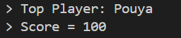

# 🐺 HoodQuest - Red Riding Hood Adventure Game

[](https://isocpp.org/)
[]()
[](LICENSE)
[]()

---

<a id="overview"></a>

## 📖 Overview

**HoodQuest** is a command-line based adventure game where the player controls "Little Red Riding Hood" and must navigate through a dangerous forest to reach Grandma's house (Node **V**) while avoiding the cunning Wolf.  
This project was developed as the final project for the **"Data Structures & Algorithms"** course, demonstrating the practical application of various data structures and pathfinding algorithms in an interactive game environment.

### 🎯 Game Objective

- Guide Red Riding Hood from her starting position to Grandmother's house (Node V)
- Avoid being caught by the Wolf
- Earn the highest score by following optimal paths
- Compete with other players through the leaderboard system

---

## 📋 Table of Contents

- [Overview](#overview)
- [Project Structure](#project-structure)
- [Key Features](#key-features)
- [Game Map](#game-map)
- [Leaderboard](#leaderboard)
- [Game Guide](#game-guide)
- [How It Works](#how-it-work)
- [Technical Details](#technical-details)
- [Development Team](#development-team)
- [Installation & Setup](#installation-setup)
- [License](#license)
- [Acknowledgment](#acknowledgment)
- [Show Your Support](#show-your-support)


<a id="project-structure"></a>

## 📂 Project Structure

This project follows the **Model-View-Controller (MVC)** architectural pattern to ensure a clean separation of concerns, maintainability, and scalability.

```
HOOD_QUEST/
│
├── 📂Include/
│   │
│   ├──📂Controller/
│   │   ├── 📄InputHandler.h
│   │   └── 📄SaveLoadManager.h
│   │
│   ├── 📂Model/
│   │   │
│   │   ├── 📂Algorithms/
│   │   │   ├── 📂PathFinders/
│   │   │   │   ├── 📄AStar.h
│   │   │   │   └── 📄Dijkstra.h
│   │   │   └── 📄BFS.h
│   │   │
│   │   ├── 📂Core/
│   │   │   ├── 📂Characters/
│   │   │   │   ├── 📄Player.h
│   │   │   │   └── 📄Wolf.h
│   │   │   └── 📂Game/
│   │   │       ├── 📄GameEngine.h
│   │   │       ├── 📄GameState.h
│   │   │       └── 📄Move.h
│   │   │
│   │   ├── 📂DataStructure/
│   │   │   ├── 📄BST.h
│   │   │   ├── 📄Graph.h
│   │   │   ├── 📄Maxheap.h
│   │   │   └── 📄Stack.h
│   │   │
│   │   └── 📂Users/
│   │       ├── 📄Hash.h
│   │       ├── 📄User.h
│   │       └── 📄UserManager.h
│   │
│   └── 📂View/
│       └── 📄CLIView.h
│
├── 📂screenshots
│   ├── 📷Game_Map.png
│   └── 📷Leaderboard.png
│
├── 📂src/
│   │
│   ├──📂Controller/
│   │   ├── 📄InputHandler.cpp
│   │   ├── 📜save.txt
│   │   └── 📄SaveLoadManager.cpp
│   │
│   ├── 📂Model/
│   │   │
│   │   ├── 📂Algorithms/
│   │   │   ├── 📂PathFinders/
│   │   │   │   ├── 📄AStar.cpp
│   │   │   │   └── 📄Dijkstra.cpp
│   │   │   └── 📄BFS.cpp
│   │   │
│   │   ├── 📂Core/
│   │   │   ├── 📂Characters/
│   │   │   │   ├── 📄Player.cpp
│   │   │   │   └── 📄Wolf.cpp
│   │   │   └── 📂Game/
│   │   │       ├── 📄GameEngine.cpp
│   │   │       ├── 📄GameState.cpp
│   │   │       └── 📄Move.cpp
│   │   │
│   │   ├── 📂DataStructure/
│   │   │   ├── 📄BST.cpp
│   │   │   ├── 📄Graph.cpp
│   │   │   ├── 📄Maxheap.cpp
│   │   │   └── 📄Stack.cpp
│   │   │
│   │   └── 📂Users/
│   │       ├── 📄Hash.cpp
│   │       ├── 📄User.cpp
│   │       └── 📄UserManager.cpp
│   │
│   └── 📂View/
│       └── 📄CLIView.cpp
│
├── 📜.gitignore
│
├── 📜CMakeLists.txt
│
├── 📜LICENSE
│
├── 📄main.cpp
│
└── 📜README.md

```

<a id="key-features"></a>

## ✨ Key Features

### 🔐 User Management

- **Secure Authentication**: Create accounts with hashed passwords
- **Persistent Storage**: User data automatically saved to `save.txt`
- **Score Tracking**: Individual player scores maintained across sessions

---

### 🧠 Advanced Algorithms

| Algorithm | Purpose | Application |
|-----------|---------|-------------|
| **Dijkstra** | Shortest path finding | Recommends optimal route to destination |
| **A*** | Heuristic-based pathfinding | Smarter route recommendation with estimated distances |
| **BFS** | Breadth-first search | Wolf movement towards player |

---

### 📊 Data Structures

| Structure | Usage |
|-----------|-------|
| **BST** | Fast user search and score updates |
| **MaxHeap** | Leaderboard (top player display) |
| **Password Hashing** | Secure password storage |
| **Stack** | Undo functionality (move history) |

---

### 🎮 Game Mechanics

- **Turn-based Movement**: Player moves first, then Wolf
- **Dice-based Wolf Movement**: Wolf moves only on even dice rolls (50% chance)
- **Smart Scoring System**:
  - Follow recommended path: **+3 points**
  - Choose alternative path: **+1 point**
  - Reach Grandma's house: **+5 points**
  - Undo a move: **-2 points**
- **Interactive Map**: Color-coded display showing player and wolf positions

---

<a id="game-map"></a>

## 🗺️ Game Map

### In-Game Map Display


_The map displays all 19 nodes with weighted edges connecting them. Red indicates Red Riding Hood's position, and Blue indicates the Wolf's position._

---

### 🗺️ Map Legend

| Color | Entity |
|-------|--------|
| 🔴 **Red** | Red Riding Hood (Player) |
| 🔵 **Blue** | The Wolf |
| ⚪ **White** | Empty/Regular Node |
| 🟡 **Yellow** | Hit Node (When the Wolf catch the Player)|

---

### 📍 Node Information

| Node | Location |
|------|----------|
| **V** | 🏠 Grandma's House (Destination) |
| **A-U** | Forest Nodes (Paths) |

---

<a id="leaderboard"></a>

## 🏆 Leaderboard Preview



*The leaderboard displays the player with the highest score, fetched efficiently using the MaxHeap data structure.*

---

<a id="game-guide"></a>

## 🎮 Game Guide

### 📋 Main Menu Options

| Option | Description |
|--------|-------------|
| **1** | Create New User Account |
| **2** | Login to Existing Account |
| **3** | View Leaderboard |
| **4** | Check User Score |
| **5** | Exit Game |

---

### 🕹️ Game Controls

| Command | Description |
|---------|-------------|
| **A - V** | Move to adjacent node (must be connected by edge) |
| **UNDO** | Revert to previous position (-2 points) |
| **EXIT** | Save progress and exit game |

---

### Game Flow

1️⃣ **Login/Create** an account  
2️⃣ **Choose Algorithm** (Dijkstra or A\*)  
3️⃣ **View Map** with your position and wolf position  
4️⃣ **Move** to adjacent nodes or use **Undo**  
5️⃣ **Reach** Grandmother's house (V) to win  
6️⃣ **Avoid** the wolf at all costs!

---  

<a id="how-it-work"></a>

## 🧠 How It Works

### Pathfinding Visualization

When you select an algorithm, the system displays:

```
Dijkstra recommended path:
A -> B -> C -> D -> E -> G -> V
Total distance: 17

A* recommended path:
A -> F -> G -> M -> S -> U -> V
Total distance: 18

```

---

### 📊 Scoring System Flowchart

```
                ┌────────────────────┐
                │       START        │
                └──────────┬─────────┘                      
                           │                                
                           ▼                                
                ┌────────────────────┐                      
                │    Player Move     │◄─────────────────────┐                      
                └──────────┬─────────┘                      │
                           │                                │
                           ▼                                │
                ┌────────────────────┐                      │
                │ Is move on         │                      │
                │ recommended path?  │                      │
                └──────────┬─────────┘                      │
                           │                                │
                ┌──────────┴──────────┐                     │
                ▼                     ▼                     │
            ┌────────────┐      ┌────────────┐              │
            │    YES     │      │     NO     │              │
            │ +3 points  │      │ +1 point   │              │
            └────────────┘      └────────────┘              │
                │                     │                     │
                └──────────┬──────────┘                     │
                           │                                │
                           ▼                                │
                ┌────────────────────┐                      │
                │     Wolf Move      │                      │
                │    (50% chance)    │                      │
                └──────────┬─────────┘                      │
                           │                                │
                           ▼                                │
                ┌────────────────────┐                      │
                │   Check win/lose   │                      │
                │     condition      │                      │
                └──────────┬─────────┘                      │
                           │                                │
                ┌──────────┴──────────┐                     │
                ▼                     ▼                     │
            ┌────────────┐      ┌────────────┐              │
            │  Win/Lose  │      │  Continue  │              │
            └────────────┘      └────────────┘              │
                  │                   │                     │
                  ▼                   └─────────────────────┘
            ┌────────────┐
            │    END     │
            └────────────┘

```

<a id="technical-details"></a>

## 🔧 Technical Details

### 📐 Dijkstra's Algorithm

Dijkstra's algorithm is a classic graph search algorithm that solves the single-source shortest path problem for a graph with non-negative edge weights. In HoodQuest, it is used to calculate the guaranteed shortest path from the player's current position to Grandma's house (Node V). It explores all reachable nodes, systematically assigning cumulative distances to each vertex until the destination is reached. This ensures that the recommended path provided to the player has the absolute minimum total weight (distance), regardless of the wolf's position, giving the player a safe and optimal route to follow.

### 📐 A* Algorithm

A* (A-Star) is a heuristic-based pathfinding algorithm that extends Dijkstra's approach by using an evaluation function to estimate the cost from a given node to the destination. In HoodQuest, it uses the Euclidean distance as a heuristic to prioritize nodes that are geographically closer to Grandma's house. By combining the actual traveled cost (gScore) with the estimated remaining cost (heuristic), A* often converges to the optimal solution much faster than Dijkstra. This makes it ideal for providing quick, intelligent route recommendations to the player while still guaranteeing the shortest path under the admissible heuristic.

### 📐 BFS Algorithm

Breadth-First Search (BFS) is a graph traversal algorithm that explores nodes level by level, guaranteeing the shortest path in terms of the number of edges (unweighted). In HoodQuest, BFS is specifically utilized for the enemy AI (Wolf movement). When activated (based on a dice roll), the wolf uses BFS to find the shortest edge-based path to the player's current position. It returns the immediate next node the wolf should move to, ensuring the wolf relentlessly chases the player step-by-step through the forest. This creates a challenging dynamic where the player must constantly outmaneuver the pursuing wolf.

---

<a id="data-structure-operations"></a>

## ⚡Data Structure Operations

### 📊 Data Structure Operations Complexity

| Structure | Search | Insert | Update | Memory |
|-----------|--------|--------|--------|--------|
| **BST** | O(log n) | O(log n) | O(log n) | O(n) |
| **MaxHeap** | O(n) | O(log n) | O(log n) | O(n) |
| **Hash** | O(1) avg | O(1) avg | O(1) avg | O(n) |
| **Stack** | O(n) | O(1) | O(1) | O(n) |

---

<a id="development-team"></a>

### 👥 Development Team

| Developer | Role | Contributions |
|-----------|------|---------------|
| [**Pouya Maleki**](https://github.com/Pouyamaleki) | **_Back-End & Algorithm Architect_** | • **_Core Back-End Logic:_** Designed and implemented the entire game engine logic, including game state management, turn-based progression, win/loss conditions, and the real-time game flow (excluding `GameEngine.cpp`, which was handled by the teammate).<br>• **_Player Pathfinding Algorithms:_** Developed and optimized **A*** and **Dijkstra** algorithms to recommend the shortest and smartest paths for the Player (Red Riding Hood) to reach Grandma's house (Node V), with A* using Euclidean distance as a heuristic for faster convergence.<br>• **_Enemy AI(Wolf) Movment:_** Implemented **BFS (Breadth-First Search)** for the Wolf's movement logic, enabling the enemy to chase the player step-by-step through the forest based on the shortest unweighted path.<br>• **_Data Structure Engineering:_** Designed and implemented **Graph** (for map modeling and pathfinding) and **Stack** (for move history and Undo functionality).<br>• **_Character Logic:_**  Engineered the behavioral logic for both _Wolf_ and _Player_ classes, including movement rules, collision detection, and turn-based interaction.<br>• **_Performance Optimization:_** Reduced pathfinding overhead through efficient memory management and heuristic tuning. |
| [**Abbas Ashoury**](https://github.com/Abbasashoury) | **_Front-End & System Integration_** | • **_Front-End Development:_** Designed and implemented the complete CLI interface (Input Handler, Output Display, and User Interaction).<br>• **_User Managment:_** Developed the secure hashing system, User Manager, and authentication logic.<br>• **_Data Structure Engineering:_** Implemented **Binary Search Trees (BST)** for efficient user data indexing and **Max Heap** for priority-based leaderboard management.<br>• **_Persistence Layer:_** Built the Save/Load Manager to serialize game states and user data.<br>• **_System Integration:_** Wrote the main `GameEngine.cpp` file to integrate the back-end logic with the front-end interface, ensuring seamless communication between modules.<br>• **_UI/UX Design:_** Created the color-coded map display and interactive menu systems. |

---

<a id="installation-setup"></a>

## 🚀 Installation & Setup

### Prerequisites

- [**MinGW32**](https://sourceforge.net/projects/mingw/) - or any other C++ Compiler
- [**CMake**](https://cmake.org/download/) - for easier Run
- [**Git**](https://git-scm.com/install/) - to clone the codes
- Any code editor like [**VSCode**](https://code.visualstudio.com/download)
- **Terminal/Command Prompt** with ANSI color support - for colored display

---

### Windows Installation

```bash
git clone <repository url>
cd Hood_Quest
mkdir build                    # Create the build Folder
cd build                       # Move to build Folder
cmake .. -G "MinGW Makefiles"  # Generate make files in build Folder
mingw32-make                   # compile the codes and make the Hood_Quest.exe in build folder
./Hood_Quest                   # run Hood_Quest.exe file
```

### Linux Installation

```bash
mkdir build      # Create the build Folder
cd build         # Move to build Folder
cmake ..         # Generate Makefiles
make             # Compile the code
./Hood_Quest     # Run the executable
```
---

<a id="license"></a>

## 📝 License

This project is licensed under the MIT License  
Feel Free to:  
- Use
- Modify
- Distribute

The program under the conditions of MIT License
see the [LICENSE](LICENSE) text more for details.

---

<a id="acknowledgment"></a>

## 🧠 Acknowledgment

- **Professor**: Dr. Ali Javidani - Data Structure and Algorithms course  
- **University**: [Bu-Ali Sina](https://www.basu.ac.ir) 
- **Resources**:  
    - [GeeksforGeeks](https://www.geeksforgeeks.org) - Algorithms references  
    - [cpp Reference](https://en.cppreference.com) - Documentation  
    - [Stack Overflow](https://stackoverflow.com) - Programming resources  


---

<a id="show-your-support"></a>

## ⭐ Show Your Support

If you found this project helpful or interesting, please consider:  
- ⭐ Starring the repository on GitHub  
- 🍴 Forking to contribute  
- 📤 Sharing with fellow students  